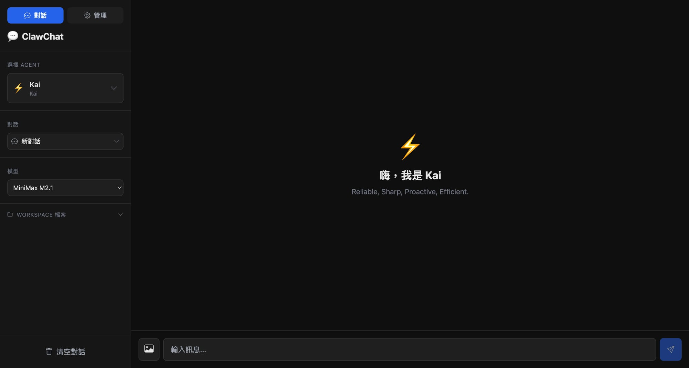

# ClawChat

一個輕量的 OpenClaw WebChat 客戶端，使用 Python 後端 + Vue.js 前端。

## 功能

- 🤖 多 Agent 切換
- 💬 會話管理
- 🖼️ 圖片上傳支援
- 📡 SSE 流式輸出
- 🎨 現代化 UI

## 截圖



## 環境需求

- Python 3.8+
- OpenClaw Gateway 運行中

## 安裝

```bash
# 克隆專案
git clone https://github.com/yourusername/ClawChat.git
cd ClawChat/web

# 安裝依賴
pip install -r requirements.txt
```

## 配置

### 環境變數

| 變數 | 預設值 | 說明 |
|------|--------|------|
| `PORT` | 8093 | 服務端口 |
| `GATEWAY_URL` | http://127.0.0.1:18789 | OpenClaw Gateway URL |
| `GATEWAY_TOKEN` | - | Gateway 訪問令牌 |
| `OPENCLAW_CONFIG_PATH` | ~/.openclaw/openclaw.json | OpenClaw 配置路徑 |

### 啟動

```bash
# 方式 1: 直接運行
python server.py

# 方式 2: 使用環境變數
GATEWAY_TOKEN=your_token python server.py

# 方式 3: 使用 .env 文件
# 創建 .env 文件:
# GATEWAY_TOKEN=your_token
# PORT=8093
```

## 使用

1. 啟動服務: `python server.py`
2. 打開瀏覽器: http://localhost:8093
3. 選擇 Agent 開始聊天

## API

| 方法 | 路徑 | 說明 |
|------|------|------|
| GET | `/api/status` | Gateway 狀態 |
| GET | `/api/agents` | Agent 列表 |
| GET | `/api/channels` | 頻道狀態 |
| GET | `/api/config` | 配置資訊 |
| POST | `/api/chat` | 聊天 (支援 SSE) |

## 部署

### 離線訪問

```bash
python server.py
# 本地訪問: http://localhost:8093
```

### 線上部署 (需要 ngrok)

```bash
# 啟動 ngrok
ngrok http 8093

# 獲得 public URL
```

## 技術棧

- **前端**: Vue.js 3 (CDN)
- **後端**: Python 3 + http.server
- **協議**: SSE (Server-Sent Events)

## License

MIT
